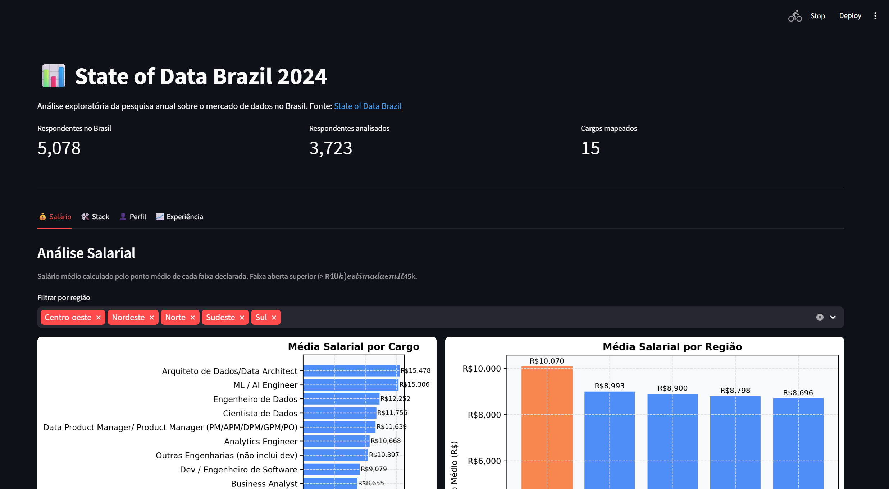
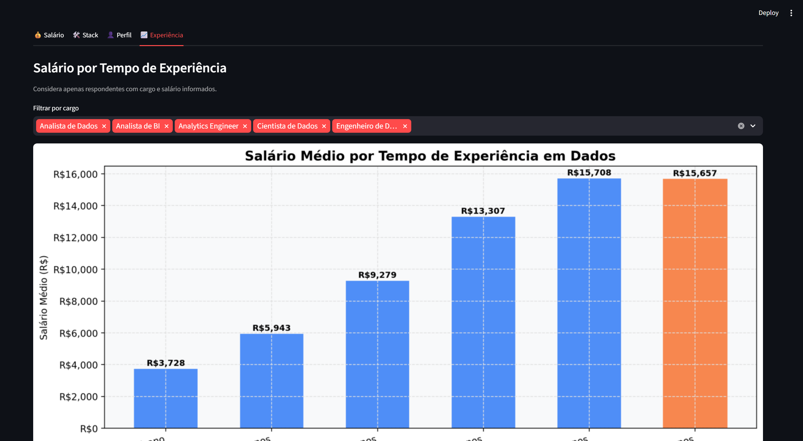
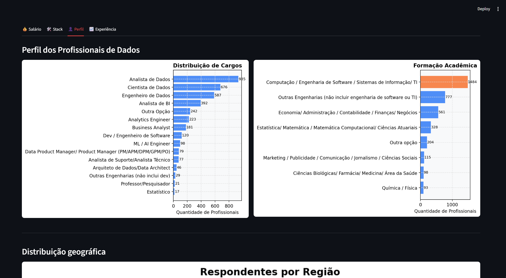
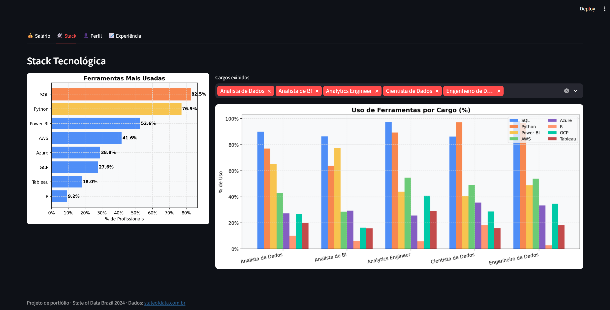

# Projeto de Análise de Dados + Dashboard

## Sobre

Este projeto foi desenvolvido como objeto de estudo, com o objetivo de praticar o processo completo de análise de dados, desde a exploração inicial até a construção de um dashboard interativo.

A proposta foi trabalhar com um dataset bruto e transformá-lo em informações mais organizadas e fáceis de visualizar.

---

## O que eu fiz

Comecei pelo notebook (`main.ipynb`), onde realizei:

* limpeza dos dados
* seleção de colunas relevantes
* tratamento de valores nulos
* algumas transformações para facilitar a análise

Após isso, gerei um dataset final (`output_final.csv`) já tratado.

---

Dashboard
Com os dados organizados, desenvolvi um dashboard utilizando Streamlit (main.py), com:

filtros interativos
visualizações gráficas
métricas principais

A ideia foi criar uma forma simples de explorar os dados.
<p align="center">
  
</p>
<p align="center">
  
</p>
<p align="center">
  
</p>
<p align="center">
  
</p>

---

## Tecnologias

* Python
* Pandas
* Streamlit
* Jupyter Notebook

---

## Aprendizados

Este projeto me ajudou a evoluir principalmente em:

* organização de um projeto de dados do início ao fim
* entendimento da etapa de limpeza de dados
* separação entre análise (notebook) e aplicação (dashboard)

---

## Como rodar

```bash
git clone https://github.com/seu-usuario/seu-repositorio.git
cd seu-repositorio
pip install -r requirements.txt
streamlit run main.py
```


## Dados

O dataset não está incluído no repositório por conta do tamanho.
Baixe diretamente no [Kaggle](https://www.kaggle.com/datasets/datahackers/state-of-data-brazil) e coloque na pasta `data/`.